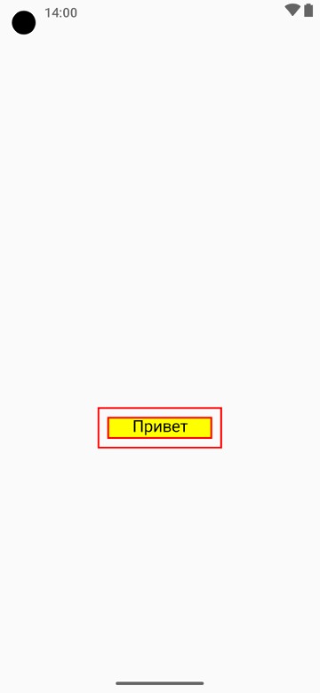
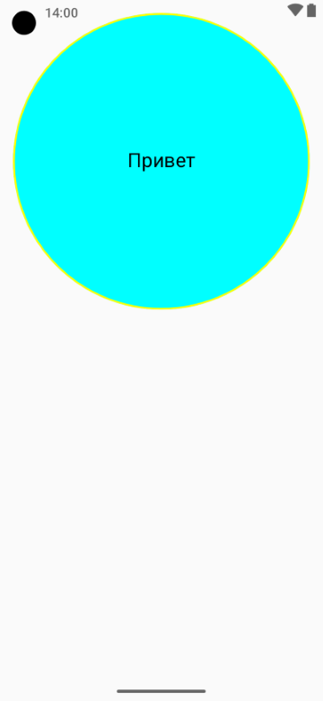

# Домашнее задание по теме "Modifier, все части"

## Комплексная работа с модификаторами и параметрами.

Задание выполняется на основании пройденной темы «Модификаторы». Необходимо написать Composable – функцию, которая будет выводить текстовое сообщение, передаваемое в параметрах этой функции.

### 1 часть задания.

Функция может принимать пустой модификатор.
При этом экран устройства будет отображать сообщение таким образом:

При применении дефолтного модификатора на экране устройства сообщение будет отображаться таким образом:

При применении кастомного модификатора на экране устройства сообщение будет отображаться таким образом:

### 2 часть задания. 

Функция может принимать модификатор по умолчанию. 
При этом экран устройства будет отображать сообщение таким образом:

При применении кастомного модификатора на экране устройства сообщение будет отображаться таким образом:

## Скриншоты домашнего задания по теме "Modifier, все части"

